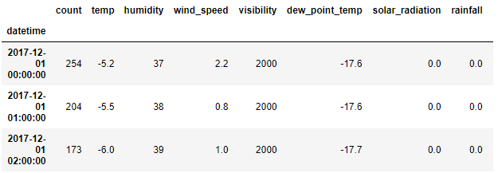
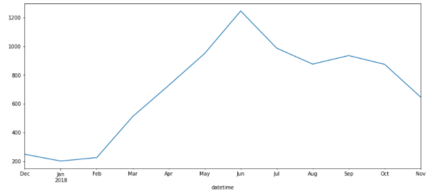
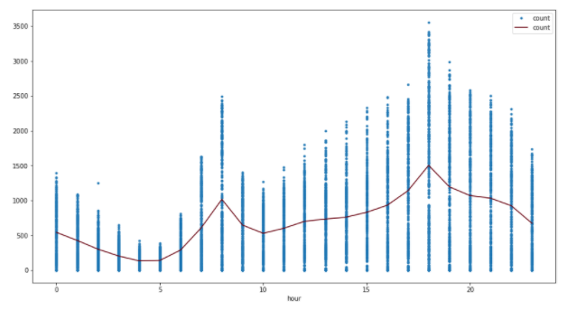
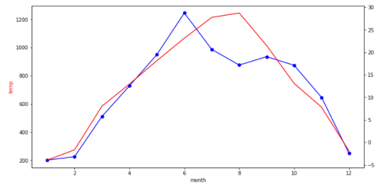
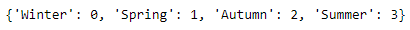
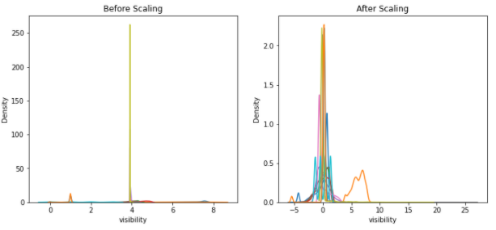
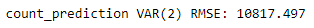
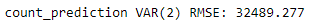

# Bikeshare Demand Forecasting: Project Overview
* Created a time series model that predictis the next-week bikeshare demand
* Created a prediction tool that predicts the next-day bikeshare demand utilizing weather data and achieved high performance
* Performed thorough feature engineering including categorical variable encoding, numeric variable normalization, feature standardization
* Selected appropriate resampling frequency according to feedback from evaluation metrics
* Built and evaluated regression models inlcuding multiple linear regression, Lasso & Ridge regression, Support Vector Regression, Decision Tree and Random Forest
* Built and evaluated a VAR time series model to perform multivariate time series analysis

## Code and Resources Used
**Python Version:** 3.8

**Packages:** sklearn, statsmodel, datetime, pandas, numpy, scipy, matplotlib, seaborn

## Data Overview
Hourly record of the volume of bikeshare usage and weather data from the end of 2017 to the end of 2018

(After cleaning and processing)

## Data Preprocessing
* Combined date and time columns to form a datetime index
* Extracted time parts from datetime column for the convenience of later data visualization
* Resampled data in a lower frequency for later modeling

## EDA
Volume is higher in warmer months, as expected

There are 2 peaks during a day - 2 rush hours

Volume is highly correlated with average temperture in the long term

## Feature Engineering
* Adding a constant value to numeric variables: For the sake of future log transformation, there can't be zero or negative values in the predictor variables
* Target-guided encoding: Encoded the "seasons" categorical variable according to its ranking in the mean count value

* OneHotEncoding categorical variales: OneHotEncoded the variables "holiday" and "functioning_day" into k-1 variables
* Numerical variable log transformation
* Feature standardardization scaling

## Model Building - Regression
I tried several models and evaluated them using Root Mean Square Error and R squared

Models
* Multiple Linear Regression
* Regularization: Lasso Regression
* Regularization: Ridge Regression
* Support Vector Regression
* Decision Tree Regression
* Random Forest

Model Performance (from best to worst)
* Random Forest: RMSE: 358; R squared: 0.693
* Support Vector Regression, RMSE: 386; R squared: 0.644
* Decision Tree Regression, RMSE: 468; R squared: 0.476
* Lasso Regression, RMSE: 526; R squared: 0.339
* Multiple Linear Regression, RMSE: 549; R squared: 0.278
* Ridge Regression, RMSE: 549; R squared: 0.278

Conclusion
* Random Forest model far outperformed all the other models except SVR
* Random, though did the best job in predicting the test set, tends to have an overfit problem in this case
* SVR did an equally good job in fitting the training set and predicting the test set, and  achieved a good score as well
* Decision Tree Regression had an overfit problem and did a poor job at predicting the test set in this case

## Model Building - Time Series Analysis
The goal of this project is to predict the demand for next month. For prediction purpose, I needed to choose a resampling frequency due to the high original frequency. I decided to test 2 different frequencies (daily and weekly), and compare the evaluation metrics at the end in order to pick the suitable one

Then, I used the augmented Dickey-Fuller test to test the stationarity of the dataset. It turned out that the data was non-stationary in either case. The first order of differencing was needed for one dataset, and the second order differencing was necessary for the other. After that, data was stationary in both cases.

Then, I used the Vector Autoregressive model for this multivariable time series analysis problem, selected the best order according to AIC, and evaluated the model based on Root Mean Square Error

The RMSE told us that it makes more sense to use daily data for prediction purpose

 
